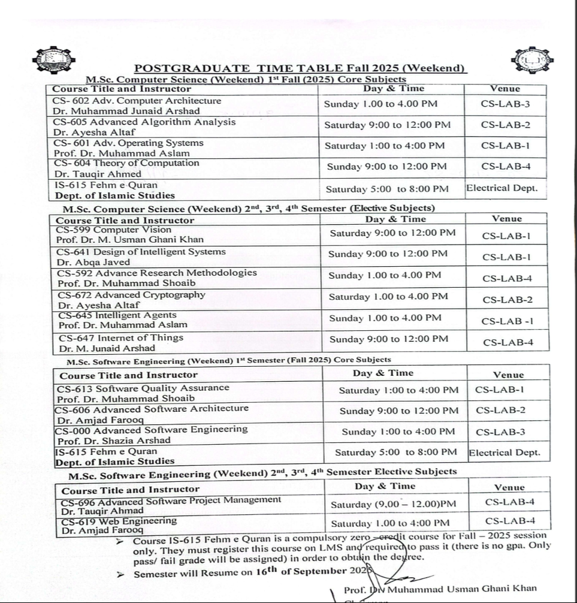

# Fall '25 - Computer Science (MSc) - Weekend

Compilation of resources for the courses.

## Courses

- [Advanced Algorithms Analysis](./advanced-algorithms-analysis/)
- [Advanced Computer Architecture](./advanced-computer-architecture/)
- [Advanced Operating Systems](./advanced-operating-systems/)
- [Fehm e Quran](./fehm-e-quran/)
- [Theory of Computation](./theory-of-computation)

## Time Table

## Contributing

Please feel free to create a pull request. Suggestions or any new resources (lecture notes, books, papers etc.) are appreciated!
